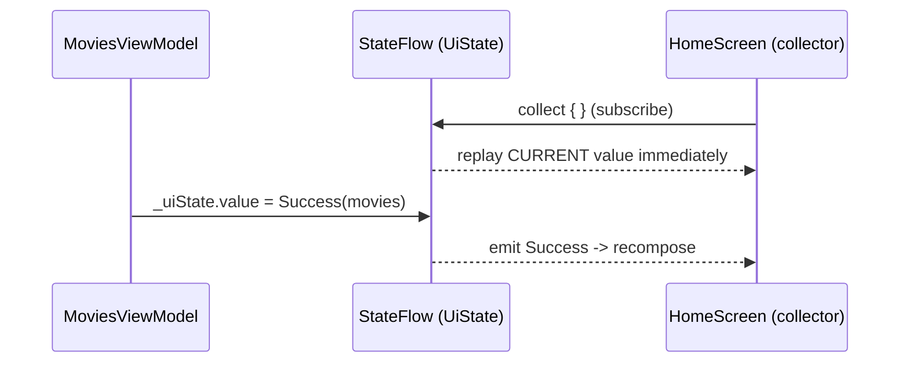

# Lesson Structure Reference

Each lesson covers exactly **one tightly-scoped concept** and must include
all 7 sections below, in order.

---

## 1. The Problem — Why This Concept Exists

Start here. Do **not** introduce the concept yet.

Show the real-world pain point the concept was designed to solve:
- What goes wrong without it?
- Write a naive or broken code example — code the learner might write before
  knowing this concept. It should compile (or feel plausible) but be wrong,
  fragile, or verbose.
- Explain clearly why this approach fails.

This makes the concept feel *necessary*, not arbitrary. The learner should
feel the pain before the relief.

> **Example for `StateFlow`:** Show a `MutableLiveData` being mutated directly
> from a background thread with no thread-safety guarantee. Explain the race
> condition risk. Then say "StateFlow was designed to handle exactly this."

---

## 2. The Concept — What It Is

Introduce the concept with a tight, precise definition:
- What is it, fundamentally? (1–2 sentence definition)
- What mental model should the learner carry?
  *(e.g. "`suspend fun` is a function that can pause execution without
  blocking a thread.")*
- Where does it fit in the Android ecosystem?
  (layer: language / framework / architecture / UI)
- Use analogies only when they genuinely compress understanding — never force them.
- Link directly to the official documentation page for this concept.

---

## 3. Examples — Three Tiers

Every lesson must include **all three tiers**. They serve different learner
states and must never be skipped.

| Tier | Name | Setup required | Purpose |
|---|---|---|---|
| 1 | **Playground** | Zero — paste into `setContent { }` | Prove the concept works in 60 seconds |
| 2 | **Single-File Realistic** | One Kotlin file — no Hilt, no Repository | Practice the pattern without architecture overhead |
| 3 | **Production Reference** | Full MVVM across multiple files | Show where each piece lives in a real codebase |

### Rules common to all tiers

- **Complete explicit imports:** Every snippet must begin with a full import
  block. No wildcard imports (`import androidx.compose.material3.*`) — use
  explicit imports so the learner sees exactly what is being pulled in.
  Group order: Android SDK / framework → Jetpack / Compose / AndroidX →
  Kotlin stdlib → third-party.
- **Comments explain *why*, not *what*:** Inline comments must explain the
  reasoning behind a line — the `what` is already visible in the code itself.
  - ✅ Good: `// remember keeps the same State instance across recompositions — without this, counter resets on every recompose`
  - ❌ Weak: `// remember the state`
- **Tier header label:** Every snippet must carry its tier label as its very
  first comment line.
- **Observation logs — see the mechanism fire:** Each *runnable* tier (Tier 1
  and Tier 2) must include at least one `Log.d()` placed exactly where the
  concept's behavior happens — so the learner watches it work in Logcat instead
  of trusting the prose. Every log line must *prove* something: print the value
  being observed, plus the thread name whenever threading or recomposition is
  the point.
  ```kotlin
  // Reads like a fact the learner can verify, not a "reached here" marker
  Log.d("TierDemo", "recompose | count=$count | thread=${Thread.currentThread().name}")
  ```
  - Tag convention: `"TierDemo"` — deliberately distinct from the `"TraceProve"`
    tag reserved for the 7d exercise, so the two never collide in one Logcat
    filter. Logcat filter: `tag:TierDemo`.
  - Place the log where the work actually happens — inside the recomposing
    Composable body, inside `collect { }`, inside `init { }` — not at the top of
    a function where it proves nothing.

> **Example (Compose recomposition):** Drop
> `Log.d("TierDemo", "recompose | count=$count")` inside a counter Composable's
> body. Each button tap prints a fresh line — the learner *sees* that reading
> state is what drives recomposition, rather than being told so.

### Tier 1 — Playground

A minimal snippet the learner can paste into `setContent { }` inside any
existing Activity and run immediately.

Rules:
- Zero external dependencies beyond a blank Compose project
- No ViewModel, no Hilt, no Repository — the concept in its purest form
- Every line must be necessary; if it doesn't demonstrate the concept, remove it
- Tier label: `// ✏️ Tier 1 — Paste inside setContent { }`
- Include exactly one well-placed `Log.d("TierDemo", ...)` (see common rules).
  For a Playground snippet a single log is enough to expose the mechanism —
  resist adding more, or it stops being minimal.
- **Immediately before the snippet**, write a "What this snippet shows" note
  (1–2 sentences) based on the actual code — not a generic description.
  Name the specific classes, functions, or behaviors the learner will observe.

  ✅ Good: *"This snippet shows how `mutableStateOf()` creates an observable
  value, and how reading it inside `Text()` makes Compose automatically
  re-render the label every time the button is clicked."*
  ❌ Weak: *"This is a simple example to get you started with state."*

### Tier 2 — Single-File Realistic

The same concept in a believable UI pattern, but with **everything in one
Kotlin file**.

Rules:
- Use `viewModel()` (not Hilt injection) with a simple hand-written ViewModel
- Use hardcoded / fake data inline (`listOf(...)`) — no Repository class
- Use realistic class names: `MoviesViewModel`, `HomeScreen`, `TaskCard`
- Structure the file top-to-bottom: Data Model → UI State sealed class →
  ViewModel → Composable(s)
- Tier label: `// ✏️ Tier 2 — Single file, paste into your project and run`
- Add `Log.d("TierDemo", ...)` in *both* the ViewModel (e.g. in `init { }` and
  on each state update) and the Composable that collects the state. This lets
  the learner trace the full path **ViewModel → StateFlow → Composable** in
  Logcat and confirm the order things fire in.
- **Immediately before the snippet**, write a "What this tier adds" note
  (1–2 sentences) explaining specifically how this extends Tier 1.

  ✅ Good: *"Unlike Tier 1 where state lived in a `remember` inside the
  Composable, here `CounterViewModel` owns the `StateFlow` — so the count
  survives screen rotation and the Composable has no state logic of its own."*
  ❌ Weak: *"This adds a ViewModel to make the example more realistic."*

### Tier 3 — Production Reference

The full production pattern split across the files where it would live in a
real project. This is a **reading reference**, not a running exercise.

Rules:
- Open each file snippet with its file path (`// ui/movies/MoviesViewModel.kt`),
  then its full import block immediately after
- Use full MVVM + Repository with Hilt (or clearly commented manual DI if
  Hilt hasn't been taught yet)
- Follow Android Architecture Recommendations: UI layer → Domain layer → Data layer
- Add a callout box at the top of this tier:
  *"📖 Read this to understand where each piece lives. You don't need to run it now."*
- Cross-reference Tier 2 explicitly:
  *"The inline ViewModel in Tier 2 maps to `MoviesViewModel.kt` here"*
- Tier label: `// 📖 Tier 3 — Production layout (reference only)`
- **No `Log.d("TierDemo", ...)` calls here.** This tier is read, not run — so
  model *production* logging instead: a guarded logger such as `Timber`, or a
  `if (BuildConfig.DEBUG)` check. State plainly that the demo logs from Tiers
  1–2 must never ship in real code, so the learner doesn't copy them across.
- **Before each file snippet**, write a "Role of this file" line (1 sentence)
  naming the architectural responsibility and how it connects to the next file.

  ✅ Good: *"`CounterViewModel.kt` — owns the `StateFlow<Int>` and exposes
  `increment()` to the UI layer; it has no knowledge of Compose."*
  ❌ Weak: *"This is the ViewModel file."*

---

## 4. Theory Deep-Dive — Why It Works This Way

This section separates memorisation from understanding. Go under the hood.

Cover:
- What the compiler or runtime actually does with this construct
  *(e.g. how `suspend` functions are transformed to state machines, how
  Compose tracks recomposition, how `by lazy` defers initialisation)*
- Relevant internal mechanisms (Coroutine Dispatcher, Recomposition, Lifecycle
  state machine, etc.)
- Performance implications, if any
- Pre-empt the top 1–2 misconceptions beginners carry about this concept

The learner should finish this section able to **predict** *why* a piece of
code behaves a certain way — not just that it does.

### Visual Model — Draw the Mechanism

Prose alone makes an invisible runtime mechanism hard to hold in the head. Every
Theory Deep-Dive must include **at least one diagram** that makes the mechanism
visible.

- **Use Mermaid.** It is text-based — so it is diffable, reviewable, and
  version-controllable alongside the lesson — and it renders natively on GitHub
  and most Markdown viewers. Add a short ASCII fallback beneath it for plain-text
  viewers that don't render Mermaid.
- **Match the diagram type to the mechanism:**
  - `sequenceDiagram` — for things that unfold *over time* across participants
    (coroutine suspend/resume, `Flow` emission → collector, event → ViewModel → UI).
  - `stateDiagram-v2` — for things with discrete *states* (Lifecycle, the state
    machine a `suspend` function compiles into, a UI-state sealed class).
  - `flowchart` — for *decisions* and data paths (does Compose recompose here?
    does `distinctUntilChanged` let this value through?).
- **One mechanism per diagram.** A diagram that shows everything teaches nothing
  — scope it to the single claim this section is proving.
- **Label nodes and arrows with real names from the lesson's own code**
  (`MoviesViewModel`, `uiState`, `Dispatchers.IO`), not abstract placeholders.
- **Reference the diagram in the prose** ("notice the collector only resumes
  *after* emission") so it is part of the explanation, not decoration.

**Example (a `StateFlow` value reaching a collector):**



ASCII fallback (for viewers without Mermaid):

```text
MoviesViewModel --(value = Success)--> StateFlow --emit--> HomeScreen -> recompose
                                          ^
                       a NEW collector first receives the current value,
                       even if it subscribed after the value was set
```

This diagram makes the lesson's claim checkable at a glance: the collector
receives the current value the instant it subscribes, *before* any new emission
— which is exactly what the 7d Trace & Prove exercise asks the learner to verify
in Logcat.

---

## 5. Kotlin & Android Conventions

Explicitly state the idiomatic Kotlin way and Android guidelines:

- Naming conventions (`camelCase` for properties, `PascalCase` for classes)
- `val` vs `var` — always `val` unless mutation is genuinely necessary
- Prefer expressions over statements (`when`, `if`, `try` as expressions)
- Android Architecture: which layer does this concept belong to?
- File placement: which package, which module?
- Any official lint rules or Android Studio warnings that apply
- What to actively avoid — with a reason
  *(e.g. "Never use `GlobalScope` in Android — it has no lifecycle awareness
  and leaks coroutines beyond the component that started them")*

---

## 6. Common Pitfalls

List 3–5 concrete mistakes beginners and intermediates make. For each:
- Show the **wrong** code
- Show the **correct** code side by side
- Explain *why* the wrong version is wrong — never just say "don't do this"

> Focus on mistakes that look reasonable at first glance — the kind that pass
> code review from someone who hasn't thought deeply about the concept.

---

## 7. Exercises

Include all four exercise types below. They build in difficulty and use
different retrieval modes to build storage strength.

### 7a. Recall Quiz

3–5 questions testing core facts from *this lesson only*.
- Multiple-choice or true/false format
- **All answer options must be the same word count** (removes formatting as a hint)
- Interactive in-browser HTML — clicking reveals whether correct + a one-sentence
  explanation. No page reload.
- Do not make the correct answer visually distinct before the learner chooses

### 7b. Code Challenge

1–2 problems where the learner writes or fixes code:
- Provide a code stub with `// TODO:` markers clearly indicating what to implement
- Describe the expected behaviour precisely
- Provide a **hidden solution** the learner reveals after attempting
  (use a `<details>` / `<summary>` toggle)
- At least one challenge must use the **Tier 2 or Tier 3 pattern** — realistic
  Android code (ViewModel, Composable, fake/real data), not just a toy snippet
- At least one challenge should involve **correcting broken code**, not just
  completing a stub

### 7c. Step-by-Step Guided Task

A concrete, numbered task the learner follows in Android Studio:
- Completable in under 20 minutes
- Each step states the action **and** the expected observable outcome
  *("After this step, the app should compile and show X on screen")*
- Scoped to exactly the concept being taught — no hidden prerequisites
- Ends with a clear "Definition of Done"
- Tied to a realistic Android scenario

### 7d. Trace & Prove + Concept-Specific Exercise

#### Trace & Prove (always required)

The learner instruments real Android code with `Log` statements to
*empirically verify* a claim from this lesson — moving from "I read it"
to "I saw it myself."

Structure every Trace & Prove in this exact order:

**1. The Claim**
State the theory as a single bold assertion.
> *Example: "A `StateFlow` collector always receives the current value
> immediately upon subscription, even if emitted before the collector started."*

**2. The Setup**
Minimal runnable code stub with `// 🔍 ADD LOG HERE` markers.
- Tag convention: `"TraceProve"` — consistent across all lessons
- Logcat filter: `tag:TraceProve`
- Under 30 lines; every log line carries thread name, value, and a short label:
  ```kotlin
  Log.d("TraceProve", "thread=${Thread.currentThread().name} | value=$value")
  ```
- For pure Kotlin topics: `println()` in Kotlin Playground is acceptable;
  clearly note this in the exercise

**3. Scenario A — Run & Observe**
- State the action: *"Launch the app and navigate to HomeScreen"*
- Show the **expected Logcat output** inside a `<details>` toggle
- Ask: *"Does this match what you expected? Why does the output look this way?"*

**4. Scenario B — The Contrasting Case**
- Change one condition to surface a nuance or edge case
- Show expected output in a `<details>` toggle
- Ask: *"What changed? What does that tell you about the concept?"*

**5. Explain It**
A written reflection prompt the learner answers in their own words.

Rules:
- The Claim must be directly verifiable from Logcat — no indirect inference
- Always include one Scenario that challenges an assumption formed from the lesson
- Never use `System.out.println()` in Android context — always `Log.d()` with `"TraceProve"` tag
- Hide expected output in a `<details>` toggle so the learner predicts before revealing

#### Concept-Specific Exercise (optional)

Include any of these when they're the best tool for making the concept stick:
- **Prediction exercise**: "What will this print / what will happen?"
- **Refactor exercise**: Rewrite Java-style or verbose Kotlin code idiomatically
- **Debugging exercise**: Diagnose and fix a broken snippet or Logcat output

Do not include for the sake of length.

---

## At the Bottom of Every Lesson

- **Primary Resource:** Link to the single best official or high-trust resource
  to read next (annotate what it covers and why it is the best next step)
- **Related Lessons:** Links to other lessons in the series (multi-lesson
  series only)
- **Ask Your Teacher:** A reminder that the learner can ask follow-up questions
  to go deeper on anything in this lesson